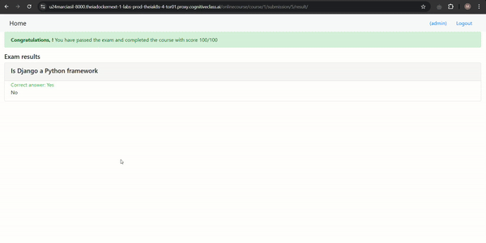

# Online Course App

Course: [Django Application Development with SQL and Databases](https://www.coursera.org/learn/developing-applications-with-sql-databases-and-django?specialization=ibm-full-stack-cloud-developer) - [IBM Full Stack Software Developer](https://www.coursera.org/professional-certificates/ibm-full-stack-cloud-developer)

## Table of contents

- [Overview](#overview)
  - [ER Diagram](#er-diagram)
- [Demo](#demo)
- [Project Features](#project-features)
- [Getting Started](#getting-started)


## Overview
This project extends an existing Django-based Online Course Application by adding a course assessment feature. This enhancement allows students to take exams, submit answers, and view their results. The project includes models, views, and templates to support online course assessments, enabling a fully integrated exam experience within the application.

### **ER Diagram**
The ER diagram design for the new assesement feature provided by the course.


## Demo


## Project Features
The application includes the following main features:
  - **Question, Choice, and Submission Models:** Models were developed to capture exam questions, answer choices, and user submissions.
  - **Course Object with Exam Models:** New course objects with exam-related data were configured through the Django admin interface for efficient content management.
  - **Course Details Template Update:** The course details page was updated to display questions with multiple-choice options.
  - **Exam Result Template:** A dedicated template was added to show exam results immediately after submission, providing feedback on performance.
  - **Submission and Evaluation Views:** Views were created to handle the process of answer submission and evaluate the results, allowing students to receive immediate feedback.
  - **Result Display and Analytics:** Added analytics for instructors to track student performance.

## Getting Started
Prerequisites
  To run this project locally, ensure you have the following installed:
    - Python 3.11
    - Django

Installation
  - Clone this repository to your local machine. (The project skeleton can be accessed by cloning this [repository](https://github.com/ibm-developer-skills-network/tfjzl-final-cloud-app-with-database.git))
  - Navigate to the project directory.
  - Install required packages
    ``` bash
    pip install -r requirements.txt
    ```
  - Run Migrations
    ``` bash
    python3.11 manage.py migrate
    ```
  - Access the Django Admin Site
    ``` bash
    python3.11 manage.py createsuperuser
    ```
  - Start the Django application:
    ``` bash
    python3.11 manage.py runserver
    ```
